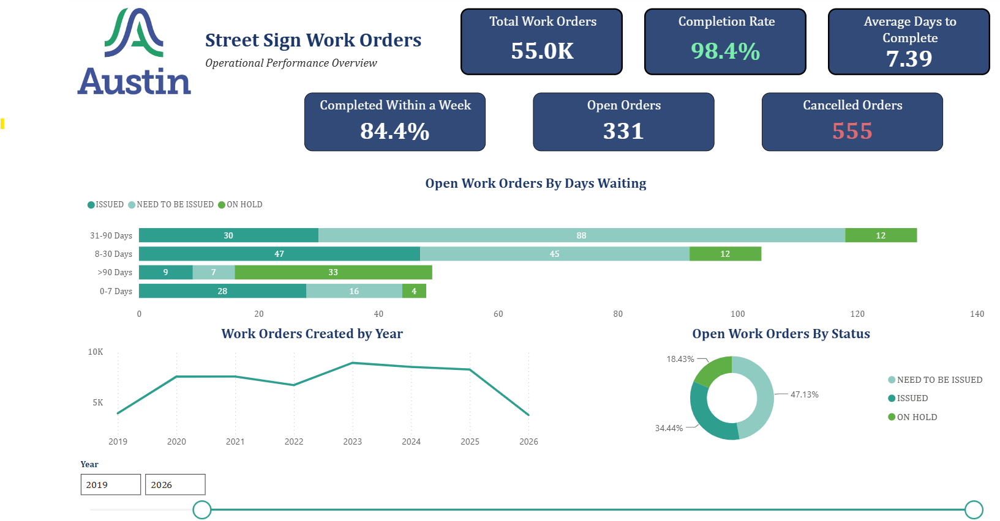

# Street Sign Work Orders - Power BI Dashboard

A self-directed Power BI project analysing 55,000+ street sign work orders from the City of Austin's open data portal, focused on completion performance and identifying where work stalls in the process.

## Why I built this

During a job interview, I was shown a simple work order dashboard - a slicer and a couple of KPI cards - and it stuck with me. I wanted to see if I could take a public dataset and build something similar end-to-end: data modelling, DAX, and a proper written methodology, the same way I'd approach a report for a manager, even with nobody asking me to.

## Data source

- **Dataset:** [Street Sign Work Orders](https://data.austintexas.gov/dataset/Work-Order-Signs-Markings-Work-Orders/qvth-gwdv) — City of Austin Open Data Portal
- **Provided by:** Signs & Markings division, Austin Transportation and Public Works
- **Coverage:** June 2018 – present (this analysis covers 2019 through 14 July 2026; 2018 excluded as a partial year, consistent with treatment of the current partial year)
- **Volume:** ~55,000 work order records

## Key findings

- **98.4% completion rate**, with an average turnaround of 7.39 days and 84.4% of completed work finishing within a week.
- **The open backlog is small** - 331 work orders, under 1% of total volume.
- **Delays are concentrated in one status, not spread evenly.** Work orders placed *On Hold* make up only 18% of the open backlog but account for 67% of everything open longer than 90 days - a disproportionate share compared to *Issued* or *Need to Be Issued*.
- Most of the remaining backlog (*Need to Be Issued*) sits in the 31–90 day range but does eventually clear, suggesting a scheduling step rather than a true stalling point.

## Data quality note

A subset of "Closed" work orders (14 records) had a null completion date - traced back to a narrow window in the dataset's earliest weeks in May–July 2018, likely a data capture gap early in the system's life. Immaterial to the metrics (14 of 55,000+ rows), but handled explicitly in the model logic - see `Days to Complete` and `Days Open` logic below.

## Data model

| Field | Type | Purpose |
|---|---|---|
| `Days to Complete` | Calculated column | Calendar days between Created Date and Completed Date, for finished work orders only |
| `Days Open` | Calculated column | Calendar days since Created Date, for currently open work orders only |
| `Age Bucket` | Calculated column | Groups open work orders into 0–7, 8–30, 31–90, and >90 day ranges |
| `Completion Rate` | Measure | Completed work orders ÷ total work orders |
| `Completed Within a Week` / `%` | Measures | Share of completed work orders finishing within 7 days |
| `Open Orders` | Measure | Count of work orders not yet Closed, Final Review, or Cancelled |
| `Cancelled Orders` | Measure | Count of work orders withdrawn before completion |
| `Calendar` table | `CALENDAR()` date table | Related to `Created Date` for year-based filtering and time intelligence |

Full DAX is documented inline in the `.pbix` file.

## Dashboard

- **KPI cards** - total volume, completion rate, average turnaround, completed-within-a-week rate, open orders, cancelled orders
- **Open Work Orders by Days Waiting** - stacked bar showing the age/status breakdown that surfaces the On Hold bottleneck
- **Work Orders Created by Year** - demand trend, based on Created Date
- **Open Work Orders by Status** - donut breakdown of the current backlog
- **Year slicer** - filters every visual by year of creation

## Tools

- Power BI Desktop (Power Query, data modelling, DAX)
- Source data: City of Austin Open Data Portal (Socrata)

## Files in this repo

- `CityOfAustinStreetWorkOrders.pbix` - the Power BI file
- `Street_Sign_Work_Orders_Documentation.pdf` - two-page write-up covering findings, metric definitions, and known limitations
- `Dashboard.png` - static preview of the dashboard

## Possible next steps

- Investigate the operational reasons behind the On Hold bottleneck (resourcing, third-party dependency, or process gap)
- Join the related [Signs & Markings Time Logs](https://data.austintexas.gov/dataset/Work-Order-Signs-Markings-Time-Logs/qvth-gwdv) dataset on Work Order ID to see whether logged labour hours help explain the pattern
- Consider a defined SLA/target turnaround specifically for On Hold work orders

---
*Built independently as a personal project - not affiliated with the City of Austin or Austin Transportation and Public Works.*
